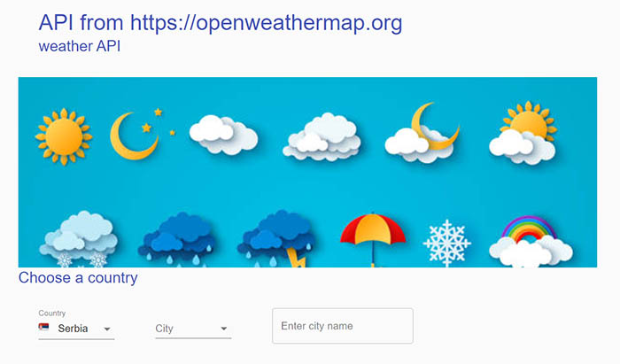
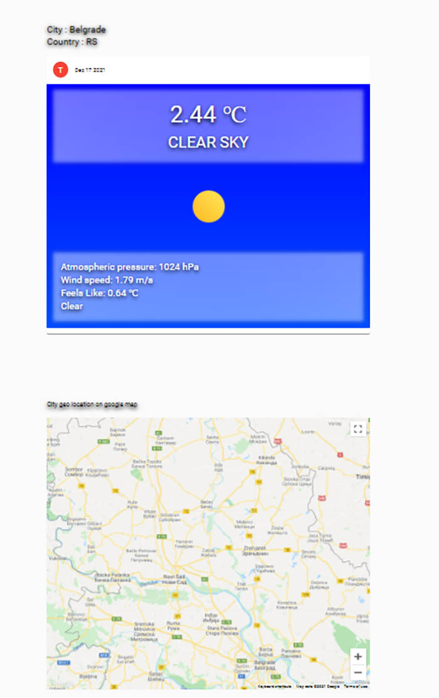
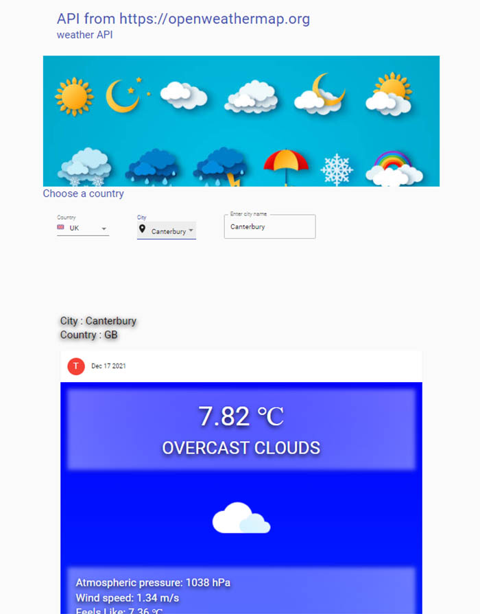

# Getting Started with Create React App

This project was bootstrapped with [Create React App](https://github.com/facebook/create-react-app).

### Weather API - OpenWeatherMap

For the development of this project, I used the following tools :
React, redux, material-ui, moment

### Installation

1. Clone the repo
```
git clone https://github.com/janix374/weather-app.git
```
2. Install NPM packages
```
npm install
```
3. Start project 
```
npm start
```





